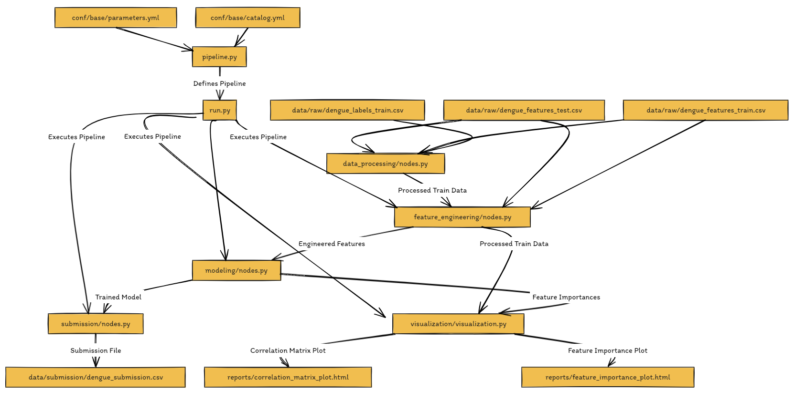

# Dengue Prediction Project

This project aims to predict dengue cases using historical data and weather information.

## Dataset
- `dengue_features_train.csv`: Training features dataset
- `dengue_labels_train.csv`: Training labels dataset
- `dengue_features_test.csv`: Test features dataset

## Project Structure
- `conf/`: Configuration files
- `data/`: Input and output data
- `notebooks/`: Jupyter notebooks for exploration and experimentation
- `reports/`: Generated reports and visualizations
- `src/`: Source code for the Kedro pipeline

## Setup
1. Install dependencies: `pip install -r requirements.txt`
2. Run the pipeline: `kedro run`

## Methodology
- Data processing: Merging datasets, handling missing values, encoding categorical variables
- Feature engineering: Splitting data, caping outliers, scaling features
- Modeling: Training a Gradient Boosting Regressor, hyperparameter tuning, cross-validation
- Submission: Preparing the submission file

For more details, refer to the source code and pipeline configuration.

